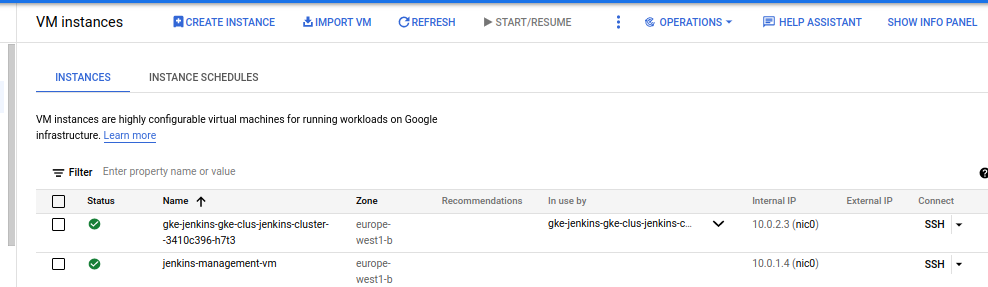

## Project requirements:
Deploy backend application on kubernetes cluster using CI/CD
jenkins pipeline using the following steps and high-level
diagram :
1. Implement secure Kubernetes cluster
2. Deploy and configure Jenkins on Kubernetes.
3. Deploy backend application on Kubernetes using Jenkins pipeline. --> [Repo](https://github.com/MostafaAlnaggar3/CI-CD-Pipeline-nodejs-app)
---
## Repo components:

- GCP-infra: this directory have terraform files that it used to build GCP resources.
- jenkins-chart: this directory has jenkins helm chart files that we need to deploy on the cluster.

---

## Tools:

<p align="center">


</p>

---

## Solution steps:

### 1- Build GCP infrastructure by terraform

```bash
$ cd GCP-Infra
$ terraform init
$ terraform apply -auto-approve
```

Check resources on GCP:




---

### 2- Connect to management instance and install gcloud, kubectl, and helm:

```bash
# ssh on management instance
$ gcloud compute ssh --zone "europe-west1-b" "jenkins-management-vm"  --tunnel-through-iap --project "mostafa-alnaggar-project"

# install helm
$ curl -fsSL -o get_helm.sh https://raw.githubusercontent.com/helm/helm/main/scripts/get-helm-3
$ chmod 700 get_helm.sh
$ ./get_helm.sh

# install gcloud-sdk and initialize gcloud
$ curl -O https://dl.google.com/dl/cloudsdk/channels/rapid/downloads/google-cloud-cli-394.0.0-linux-x86_64.tar.gz
$ tar -xf google-cloud-cli-394.0.0-linux-x86_64.tar.gz
$ ./google-cloud-sdk/install.sh
$ ./google-cloud-sdk/bin/gcloud init

# install gcloud packages and update repo
$ sudo apt-get install apt-transport-https ca-certificates gnupg
$ echo "deb [signed-by=/usr/share/keyrings/cloud.google.gpg] https://packages.cloud.google.com/apt cloud-sdk main" | sudo tee -a /etc/apt/sources.list.d/google-cloud-sdk.list
$ curl https://packages.cloud.google.com/apt/doc/apt-key.gpg | sudo apt-key --keyring /usr/share/keyrings/cloud.google.gpg add -
$ sudo apt-get update

# install auth-plugin
$ sudo apt-get install google-cloud-sdk-gke-gcloud-auth-plugin

# to install kubectl
$ sudo apt-get install kubectl

# connect to the cluster
$ gcloud container clusters get-credentials jenkins-gke-cluster --zone europe-west1-b --project mostafa-alnaggar-project

# check cluster connection 
$ kubectl get nodes
```

These configurations will install the first time of creating the instance and after creating it, I will make a new image from it to use if I need to make a new instance again as I made it in the management-vm terraform file.


---

### 3-  Copy Jenkins helm chart to the management instance and deploy it:

```bash
# copy helm chart
$ gcloud compute scp --recurse jenkins-chart jenkins-management-vm:~/

# create jenkins and jenkins-app namesapce
$ kubectl create namespace jenkins-ns
$ kubectl create namespace jeknins-app

# change namespace
$ kubectl config set-context --current --namespace=jenkins-ns

# install helm chart
$ helm install jenkins jenkins-chart

# check Check k8s resources
$ kubectl get all

```

Check k8s resources:


Access Jenkins service IP on [http://34.140.33.50:8080/](http://34.140.33.50:8080/) ,get the administrator password, install recommended plugins and create admin user:

```bash
# get administrator password
$ kubectl exec -it pod/jenkins-8499454ff4-dsw9h bash
$ cat /var/jenkins_home/secrets/initialAdminPassword
```

Finally, welcome to Jenkins 🥳:


